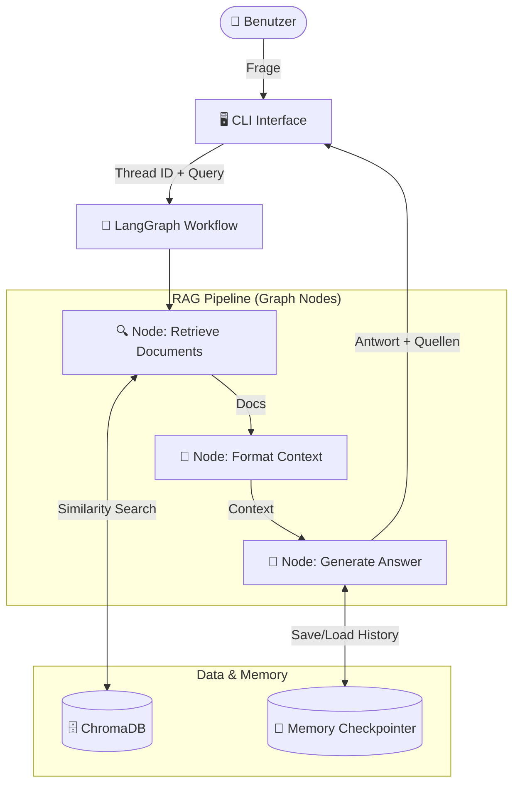

Dies ist ein Entwurf für eine **professionelle, technische und beeindruckende README.md** auf Deutsch. Sie ist strategisch so aufgebaut, dass sie sowohl HR-Manager (durch klare Struktur und Business-Value) als auch technische Leiter (durch Tiefe in Architektur, Code-Entscheidungen und Reflexion) anspricht.

Ich habe Diagramme (Mermaid-Syntax) integriert, um den Workflow zu visualisieren, und spezielle Abschnitte eingefügt, die deine End-to-End-Verantwortung und strategische Entscheidungen hervorheben.

---

# Steuerheuer: RAG-basierter UStG-Assistent ⚖️🤖

> **Ein fortschrittliches Retrieval-Augmented Generation (RAG) System, das komplexe deutsche Umsatzsteuergesetze (UStG) durch KI zugänglich macht. Entwickelt mit Fokus auf präzise Quellenangaben, Konversationsgedächtnis und einer robusten XML-Datenpipeline.**

---

## 📋 Inhaltsverzeichnis

1. Über das Projekt
2. Architektur & Workflow
3. Technische Tiefenanalyse
   * **Datenaufbereitung & Parsing**
   * **Vektorsuche & Embeddings**
   * **State-Management mit LangGraph**
4. Herausforderungen & Entscheidungen
5. Projektmanagement & Ownership
6. Installation & Nutzung
7. Lizenz & "Bezahlung"

---

## 🎯 Über das Projekt

**Steuerheuer** ist ein KI-gestützter Assistent, der Steuerberatern, Buchhaltern und Finanzinteressierten hilft, spezifische Fragen zum Umsatzsteuergesetz (UStG) zu beantworten. Im Gegensatz zu generischen LLMs basiert jede Antwort auf **tatsächlichen Gesetzentwürfen**, die in Echtzeit abgerufen und zitiert werden (RAG-Ansatz).

Dieses Projekt demonstriert den vollständigen Lebenszyklus einer modernen KI-Anwendung: Von der Rohdatenverarbeitung komplexer XML-Strukturen über das Vektor-Embedding bis hin zur Orchestrierung eines kontextsensitiven Chat-Systems mittels LangGraph.

### Kernfunktionen

* **Gesetzes-basierte Antworten:** Minimiert Halluzinationen durch strengen RAG-Kontext.
* **Präzise Zitation:** Jede Antwort liefert die exakten Paragraphen (z.B. *§ 12 Abs. 2 UStG*).
* **Konversationsgedächtnis (Memory):** Dank LangGraph und Checkpointing erinnert sich das System an vorherige Fragen im Chat-Verlauf.
* **CLI-Interface:** Eine robuste Kommandozeilenoberfläche ermöglicht den schnellen Einsatz in internen Entwickler-Workflows ohne Frontend-Overhead.

---

## 🧩 Architektur & Workflow

Das System folgt einer **Stateful RAG-Architektur**. Im Gegensatz zu linearen Chains verwende ich einen Graphen, der den Zustand (State) der Konversation hält und manipuliert.

### High-Level Workflow



**Technologie-Stack:**

* **Orchestration:** LangChain & LangGraph (Python)
* **LLM:** OpenAI `gpt-4o-mini` (Optimiert für Kosten/Leistung)
* **Vector Store:** ChromaDB (Persistente Speicherung)
* **Embeddings:** OpenAI `text-embedding-3-small`
* **Processing:** `lxml` für Parsing, `tiktoken` für Token-Management

---

## 🔬 Technische Tiefenanalyse

### 1. Datenaufbereitung & XML Parsing Strategie

Die Qualität eines RAG-Systems steht und fällt mit der Qualität der Chunks. Anstatt das Gesetz als reinen Text zu behandeln, habe ich die **XML-Struktur** der Rohdaten genutzt.

* **Der Ansatz:** Das Skript `parse_ustg.py` nutzt `lxml`, um die hierarchische Struktur (Paragraphen, Absätze, Nummern) zu verstehen.
* **Intelligentes Chunking:**
* *Normale Absätze:* Werden als logische Einheiten (`<P>`) extrahiert.
* *Große Listen (> 1000 Token):* Paragraphen mit vielen Unterpunkten (wie § 4 UStG) werden automatisch gesplittet, um das Kontext-Fenster des LLMs nicht zu überfluten.
* *Metadaten-Anreicherung:* Jeder Chunk erhält präzise Metadaten (`full_reference`, `chunk_id`, `gesetz`), was das Zitieren im späteren Verlauf ermöglicht.


### 2. Vektorsuche & Embeddings

Die Daten werden mittels `index_documents.py` in **ChromaDB** indexiert.

* **Modell:** `text-embedding-3-small`. Dieses Modell bietet ein hervorragendes Verhältnis zwischen Kosten und semantischer Erfassungsleistung für deutschsprachige juristische Texte.
* **Retrieval:** Ich verwende eine Ähnlichkeitssuche (Similarity Search) mit `k=5`, um dem LLM genügend Kontext zu geben, ohne Rauschen zu erzeugen.

### 3. State-Management mit LangGraph

In `graph_v2.py` und `nodes_v2.py` wurde von einer einfachen Chain auf einen **StateGraph** gewechselt.

* **Warum?** Eine einfache Chain ist statisch. LangGraph ermöglicht zyklische Abläufe und persistentes Gedächtnis.
* **MemorySaver:** Durch die Implementierung eines Checkpointers merkt sich das System den Kontext.
* *User:* "Wie hoch ist die Steuer?" -> *System:* "19%."
* *User:* "Und für Bücher?" -> *System:* (Weiß, dass es um Steuersätze geht) "Für Bücher gilt der ermäßigte Satz von 7%."


---

## ⚖️ Herausforderungen & Entscheidungen (Pros & Cons)

Jedes technische Projekt erfordert Abwägungen. Hier ist eine transparente Analyse der Architektur:

### ✅ Vorteile (Pros)

* **Strukturierte Datenbasis (XML):** Die Verwendung der offiziellen XML-Daten des Bundesanzeigers war ein entscheidender Vorteil. Sie erlaubte eine chirurgisch präzise Trennung der Gesetze, die mit reinem Text-Splitting (z.B. `RecursiveCharacterTextSplitter`) unmöglich gewesen wäre.
* **Kosten-Effizienz:** Durch die Wahl von `gpt-4o-mini` und `text-embedding-3-small` ist das System extrem günstig im Betrieb, bei gleichzeitig hoher Antwortqualität für diesen Anwendungsfall.
* **Interne Skalierbarkeit:** Die CLI-Architektur erlaubt es, das Tool problemlos auf Servern zu deployen, auf die verschiedene Teammitglieder via SSH zugreifen können – ideal für interne Firmen-Tools.

### ⚠️ Herausforderungen & Cons

* **Die "Vokabular-Lücke" (Vocabulary Gap):**
* *Problem:* Nutzer fragen umgangssprachlich ("Was muss ich zahlen, wenn ich wenig verdiene?"), das Gesetz nutzt Fachsprache ("Kleinunternehmerregelung").
* *Lösung:* Das Embedding-Modell fängt vieles ab, aber für ein Produktionssystem wäre ein "Query Expansion"-Schritt (HyDE) sinnvoll, um die Nutzerfrage vor der Suche in Juristendeutsch zu übersetzen.


* **Kontext-Grenzen:** Bei sehr komplexen steuerlichen Sachverhalten, die Paragraphen aus völlig unterschiedlichen Abschnitten verknüpfen müssen, stößt einfaches RAG an Grenzen. Hier wäre ein Agenten-Ansatz (der mehrfach suchen darf) der nächste Entwicklungsschritt.

---

## 📅 Projektmanagement & Ownership

Dieses Projekt wurde nicht nur "codiert", sondern **gemanagt**. Ich habe den gesamten Prozess von der Anforderungsanalyse bis zum Deployment verantwortet.

* **Planung:** Nutzung von **OpenProject** zur Erstellung von Work Packages (WPs), Meilensteinen und Timelines.
* **Dokumentation:** Der detaillierte Projektplan inklusive aller Tasks und Subtasks liegt diesem Repository bei (`/docs/project_plan.pdf`).
* **Methodik:** Iteratives Vorgehen (MVP in v1, State-Management in v2).

Dies demonstriert meine Fähigkeit, in einem professionellen Umfeld eigenverantwortlich Lösungen zu liefern.

---

## 🚀 Installation & Nutzung

Das Projekt ist Open Source. Du kannst es lokal ausführen.

### Voraussetzungen

* Python 3.10+
* OpenAI API Key

### Setup

1. **Repository klonen:**
```bash
git clone https://github.com/dein-username/steuerheuer-rag.git
cd steuerheuer-rag

```


2. **Dependencies installieren:**
```bash
pip install -r requirements.txt

```


3. **Environment setzen:**
Erstelle eine `.env` Datei:
```bash
OPENAI_API_KEY=sk-dein-key-hier...

```


4. **Daten parsen & indexieren:**
```bash
python scripts/parse_ustg.py    # Konvertiert XML -> JSON
python scripts/index_documents.py # Erstellt die Vektor-Datenbank

```


5. **Starten (CLI):**
```bash
python scripts/cli_v2.py

```


---

## 🤝 Lizenz & "Bezahlung"

Dieses Projekt ist unter der **MIT Lizenz** veröffentlicht und komplett kostenlos nutzbar.

1. ⭐ ** Gib bitte diesem Repository einen Stern** oben rechts.
2. 💬 **Sende mir Feedback:** Hast du einen Bug gefunden oder eine Idee? Schreib mir eine E-Mail oder öffne ein Issue. Feedback ist der Treibstoff für Verbesserung.

---

*Disclaimer: Dieses Tool dient zu Demonstrationszwecken. Die Antworten stellen keine rechtlich bindende Steuerberatung dar.*


